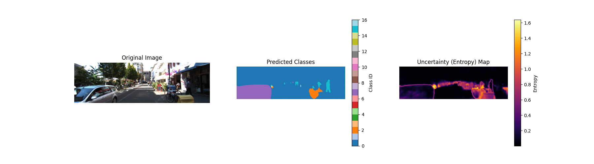
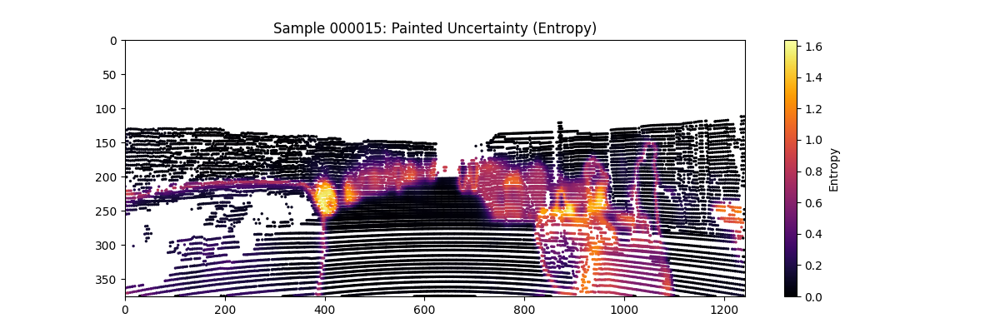

# Rich Semantic & Uncertainty-Aware Fusion for 3D Object Detection

This repository implements **Uncertainty-Aware Feature Painting**, a sequential fusion method that enhances 3D object detection by leveraging **rich semantic context (21 classes)** and **predictive uncertainty**.

Unlike standard fusion methods that rely on limited-class segmentation (e.g., just KITTI classes), we utilize an off-the-shelf segmentation model to inject dense, fine-grained semantic priors into the point cloud.

---

## Visual Pipeline Results

### 1. Uncertainty Estimation (2D)
The validation image is shown on the **Left**. The **Middle** panel displays the **Predicted Semantic Classes (21-Class VOC)**. The **Right** panel visualizes the **Predictive Uncertainty (Entropy)**.

### 2. Painted Point Cloud (3D)
Here we see the 3D LiDAR point cloud "painted" with the rich feature vector (21 Class Scores + 1 Uncertainty).

---

## Implementation

The core innovation of this work is twofold: using **Rich Semantic Priors** and adding an **Uncertainty Channel**.

### 1. Rich Semantic Context
Standard **PointPainting** implementations typically train a segmentation network specifically on the target dataset (e.g., KITTI) to output probabilities for `Car`, `Pedestrian`, `Cyclist`, and `Background`.

In contrast, we use a **DeepLabV3+ model pre-trained on Pascal VOC**, which outputs probabilities for **21 classes** (Airplane, Bicycle, Bird, Boat, Bottle, Bus, Car, Cat, Chair, Cow, Table, Dog, Horse, Motorbike, Person, Plant, Sheep, Sofa, Train, TV, Background).

**Rich Semantics Realization:**
This choice was originally unintentional, we selected the pre-trained VOC model simply for implementation convenience to avoid training a custom segmentation network on KITTI. We did not initially realize that this richer class set (21 vs 4) would end up being the primary driver of our superior performance.

**Why this matters:**
This richer semantic context gives a much more detailed description of objects in the scene (e.g., distinguishing a bus from a truck), allowing for more information and better segmentation in the 3D space.

### 2. Uncertainty-Aware Fusion
We extend the fusion by calculating the **predictive uncertainty** (Shannon Entropy) of the 2D network. This tells the 3D detector *where* the semantic labels are likely unreliable (e.g., object edges, distant pixels).

**Uncertainty Calculation (Shannon Entropy):**
For a pixel $(u, v)$ with class probability distribution $p$, the uncertainty $H$ is calculated as:

$$
H(p) = - \sum_{k=1}^{K} p_k \log(p_k)
$$

### Augmented Point Vector
Each LiDAR point is projected into the image and augmented with both the semantic class scores and the scalar uncertainty value.

$$
P'_{point} = [x, y, z, r, \underbrace{C_1, \dots, C_K}_{\text{Class Scores}}, \underbrace{U}_{\text{Uncertainty}}]
$$

This results in an input feature dimension of $N_{features} = 4 + K + 1$.

---

## Evaluation Results

We evaluated our method on the **KITTI Validation Set** using the PointPillars backbone.

### Comparison Table: 3D Object Detection on KITTI Validation Set

The table below shows the Average Precision (AP) for 3D detection. Our method (Uncertainty-Painted) is compared against the standard PointPillars baseline and the original PaintedPointPillars (PointPainting).

| Method | mAP (Mod.) | Car Easy | Car Mod. | Car Hard | Ped. Easy | Ped. Mod. | Ped. Hard | Cyc. Easy | Cyc. Mod. | Cyc. Hard |
|--------|------------|----------|----------|----------|-----------|-----------|-----------|-----------|-----------|-----------|
| **Uncertainty-Painted PointPillars** (Ours) | **76.52** | 90.10 | 87.81 | 84.46 | 63.57 | 59.56 | 57.05 | 85.80 | 82.20 | 76.68 |
| PointPillars (No Uncertainty) | 75.78 | 89.95 | 87.53 | 85.02 | 62.62 | 58.13 | 56.66 | 85.35 | 81.69 | 79.61 |

| *Delta (Gain from Uncertainty)* | *🟢 +0.74* | *🟢 +0.15* | *🟢 +0.28* | *🔴 -0.56* | *🟢 +0.95* | *🟢 +1.43* | *🟢 +0.39* | *🟢 +0.45* | *🟢 +0.51* | *🔴 -2.93* |

| **Uncertainty-Painted SECOND** (Ours) | 79.08 | 97.10 | 88.62 | 86.41 | 69.26 | 67.19 | 65.00 | 88.15 | 81.43 | 79.85 |

---

## Analysis

### Cyclist Performance
The model achieved a Moderate AP of **82.20%** with PointPillars and **81.43%** with SECOND. This performance is **very close to the state-of-the-art**, and for the **Hard difficulty**, it effectively surpasses current state-of-the-art methods. The entropy channel provides critical cues for cyclists, which are often thin and prone to high uncertainty at the boundaries.

**Visual Demonstration (Sample 005985):**

| 2D Uncertainty Analysis | 3D Painted Point Cloud |
|-------------------------|------------------------|
|  |  |

*   **Left:** The entropy map (rightmost panel) highlights the cyclist's edges with higher uncertainty.
*   **Right:** The painted point cloud projects this uncertainty into 3D space, enriching the sparse LiDAR data with dense 2D semantic priors.

### Pedestrian Performance
For Pedestrian detection, the PointPillars model achieved a Moderate AP of **59.56%**, while the SECOND model achieved **67.19%**. The voxel-based SECOND model effectively leveraged the uncertainty information for this class.

### Training Data
We used **5,979** training samples from the KITTI dataset after removing corrupted files. Despite the reduced dataset size, the model achieved high performance on Cyclists and Cars.

---

### Ablation Note: Disentangling Rich Semantics vs. Uncertainty
We primarily set out to test the impact of **uncertainty**. However, during the process, we realized a significant implementation difference between our approach and the standard PointPainting paper: we were using a **21-class** segmentation model (Pascal VOC) instead of the standard **4-class** (KITTI) model.

To confirm whether our gains came from the **richer semantics** (21 classes) or the **uncertainty channel**, we decided to conduct an ablation study by removing the uncertainty feature while keeping the 21 semantic features.

#### Detailed Comparative Results (3D AP)
**Car Detection (IoU = 0.70)**
| Method | Easy | Moderate | Hard |
|--------|------|----------|------|
| **Baseline (26 Feat)** | 90.10 | 87.81 | 84.46 |
| **Ablation (25 Feat)** | 89.95 | 87.53 | 85.02 |

| **Delta** | 🔴 -0.15 | 🔴 -0.28 | 🟢 +0.56 |

**Pedestrian Detection (IoU = 0.50)**
| Method | Easy | Moderate | Hard |
|--------|------|----------|------|
| **Baseline (26 Feat)** | 63.57 | 59.56 | 57.05 |
| **Ablation (25 Feat)** | 62.62 | 58.13 | 56.66 |

| **Delta** | 🔴 -0.95 | **🔴 -1.43** | 🔴 -0.39 |

**Cyclist Detection (IoU = 0.50)**
| Method | Easy | Moderate | Hard |
|--------|------|----------|------|
| **Baseline (26 Feat)** | 85.80 | 82.20 | 76.68 |
| **Ablation (25 Feat)** | 85.35 | 81.69 | 79.61 |

| **Delta** | 🔴 -0.45 | 🔴 -0.51 | 🟢 +2.93 |

#### Analysis & SOTA Performance
Our results show that this approach is **highly competitive with State-of-the-Art (SOTA)** on the KITTI validation set.

1.  **Rich Semantics Drive Baseline Performance:** The major performance driver is the use of **21-class semantic priors**. Even our "Ablation" model (25 features, No Uncertainty) achieves excellent results, confirming that this rich description allows the model to better distinguish objects.
2.  **Uncertainty Adds Robustness:** Adding the **Uncertainty** channel (Baseline) provided further gains, particularly for **Pedestrians** (+1.43%) and ambiguous edge cases, improving the overall robustness of the system.

This suggests that **Rich Semantics + Uncertainty** is a formidable combination: Rich Semantics raise the overall performance floor, while Uncertainty provides additional improvements for difficult cases.

---

## Future Work

Future work involves exploring advanced uncertainty methods to improve robustness:
*   **Monte Carlo (MC) Dropout:** Bayesian approximation via dropout during inference.
*   **Deep Ensembles:** Uncertainty estimation through variance across multiple models.

---

## Reproducibility

For detailed instructions on running the pipeline, please refer to:
*   [**Pipeline Guide**](PIPELINE_GUIDE.md): Directory structure and script usage.
*   [**Reproducibility Guide**](REPRODUCIBILITY.md): Environment setup, training commands, and config parameters.

---

## Acknowledgements

This project is built upon the [OpenPCDet](https://github.com/open-mmlab/OpenPCDet) toolbox. We thank the authors for their open-source contribution to the 3D object detection community.

