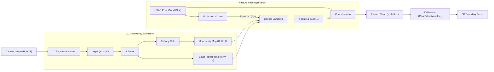

# Uncertainty-Aware Feature Painting: Technical Architecture & Details

## 1. System Architecture Diagram

## 2. Mathematical Formulation

### 2.1. 2D Uncertainty Estimation (Entropy-Based)
Given an input image $I$, the 2D network outputs a probability distribution over $K$ classes for each pixel $(u, v)$.
Let $p_{u,v} \in \mathbb{R}^K$ be the softmax probability vector at pixel $(u, v)$.

The **predictive uncertainty** $U_{u,v}$ is quantified using Shannon Entropy:
$$ U_{u,v} = H(p_{u,v}) = - \sum_{k=1}^{K} p_{u,v}^{(k)} \log(p_{u,v}^{(k)}) $$

*   **Low Entropy (near 0):** The model is confident (one class has probability $\approx 1$).
*   **High Entropy:** The model is uncertain (probabilities are spread out, e.g., uniform distribution).

### 2.2. LiDAR-to-Image Projection
To associate a 3D LiDAR point $P_{lidar} = (x, y, z, 1)^T$ with a 2D pixel $(u, v)$, we use the calibration matrices:
1.  **Extrinsic:** Transform LiDAR to Camera coordinates.
    $$ P_{cam} = T_{velo \to cam} \times P_{lidar} $$
2.  **Intrinsic:** Project Camera coordinates to Image plane.
    $$ P_{img} = P_{rect} \times R_{rect}^{(0)} \times P_{cam} $$
    $$ \begin{bmatrix} u' \\ v' \\ w' \end{bmatrix} = P_{img} $$
    $$ u = u'/w', \quad v = v'/w' $$

### 2.3. Feature Painting
For each valid LiDAR point projecting to $(u, v)$ inside the image bounds:
1.  Sample the Class Probability vector $C = p_{u,v}$ (Size $K$).
2.  Sample the Uncertainty Scalar $U = U_{u,v}$ (Size $1$).
3.  Construct the Augmented Point vector:
    $$ P'_{point} = [x, y, z, r, C_1, ..., C_K, U] $$
    Total dimensions: $4 + K + 1$.

## 3. Network Modifications

### 3.1. 2D Network (The "Painter")
*   **Architecture:** DeepLabV3+ with ResNet50 or ResNet101 backbone.
*   **Pre-training:** Cityscapes or KITTI Semantic Segmentation dataset.
*   **Inference:**
    *   Standard: Single forward pass $\to$ Softmax $\to$ Entropy.
    *   *Advanced (Optional):* MC Dropout. Perform $T$ forward passes with dropout on.
        $$ U_{u,v} = \text{Var}(\{p_{u,v}^{(t)}\}_{t=1}^T) $$

### 3.2. 3D Network (The "Detector")
*   **Architecture:** PointPillars (Fast) or VoxelNet (Accurate).
*   **Input Layer Modification:**
    *   Standard PointPillars VFE (Voxel Feature Encoder) takes $(x, y, z, r, x_c, y_c, z_c, x_p, y_p)$.
    *   **Modified VFE:** Must accept $(x, y, z, r, C_1...C_K, U, ...)$.
    *   The initial Linear Layer (MLP) size increases from $N_{in}$ to $N_{in} + K + 1$.
*   **Attention Mechanism (Implicit vs Explicit):**
    *   *Implicit:* The network learns weights for the extra channels. If $U$ is high, it might learn to downweight the $C$ features.
    *   *Explicit (Future Work):* Design a specific gate layer $G = \sigma(W \cdot U)$ to scale the semantic features before VFE.

## 4. Data Flow & Tensor Shapes

1.  **Input Image:** $(B, 3, H, W)$
2.  **Segmentation Output:** $(B, K, H, W)$
3.  **Uncertainty Map:** $(B, 1, H, W)$
4.  **Input Point Cloud:** $(B, N_{points}, 4)$
5.  **Painted Point Cloud:** $(B, N_{points}, 4 + K + 1)$
6.  **Voxelization:** Points are grouped into pillars/voxels.
7.  **3D Backbone Output:** $(B, C_{feat}, H_{grid}, W_{grid})$
8.  **Detection Head:** $(B, N_{anchors} \times (7+Dir), H_{grid}, W_{grid})$

## 5. Implementation Strategy

1.  **Step 1: Offline Painting Script**
    *   Don't try to do this on-the-fly during training initially.
    *   Write a script `create_painted_kitti.py` that reads KITTI data, runs segmentation, projects, and saves `.npy` or `.bin` files of the painted clouds.
    *   This speeds up 3D training significantly.

2.  **Step 2: OpenPCDet Config**
    *   Clone a standard PointPillars config.
    *   Modify `POINT_CLOUD_RANGE` if needed.
    *   **Crucial:** Update `NUM_POINT_FEATURES` in the dataset config and model config to include the extra dimensions.

3.  **Step 3: Training**
    *   Train on the offline-painted dataset.
    *   Monitor loss convergence compared to baseline.
